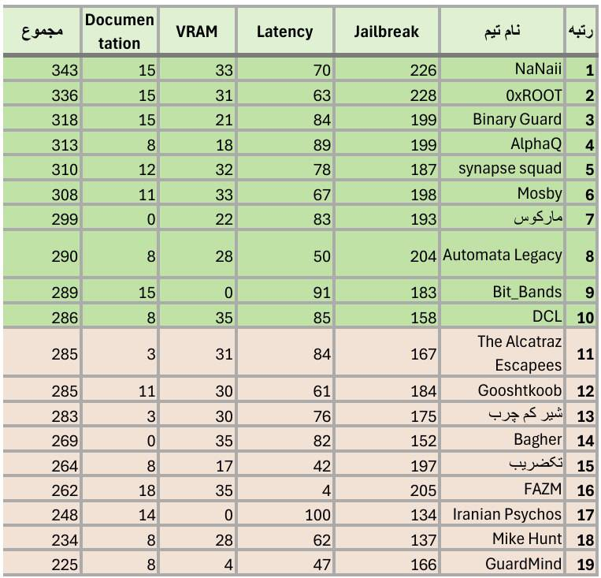

# 🛡️ Phase 3 — Final Round: Safe Agent Defense  
### Secure AI Hackathon | Team Marcus ⚔️🤖

---

## 📌 Overview

In the **final phase** of the hackathon, teams were tasked with building a **secure agent** to protect a main LLM from malicious inputs (Jailbreak attempts).  
The goal was to create a **production-style system** capable of:

- Handling **normal inputs** naturally  
- Responding safely to **sensitive prompts**  
- Blocking **jailbreak attacks**  
- Producing **non-template and helpful responses**  

The system had to behave robustly, **without knowing the type of input** (normal, sensitive, or jailbreak).

---

## 📊 Dataset Structure

The agent was tested on a dataset derived from previous phases, consisting of:

- **Jailbreak Inputs:** prompts that previously caused unsafe outputs  
- **Normal Inputs:** standard harmless questions  
- **Sensitive Inputs:** structurally risky inputs that require safe, helpful answers  

The challenge: produce safe and correct outputs while preventing unsafe behavior.

---

## ⚙️ Allowed Tools & Constraints

- **Main API model:** Only the provided LLM could generate final responses  
- **Open-source models:** ≤ 10B parameters from HuggingFace, for guard or auxiliary tasks  
- **Techniques allowed:** RAG, search, data augmentation, fine-tuning, guard models  
- **Important:** The main model could **not be replaced**  

---

## 🧠 Safe Agent Architecture

The **Safe Agent** is built as a modular defense pipeline:

### 1. `precheck(user_input: str)`  

- **Purpose:** Classify input as safe/unsafe and detect topic  
- **Model:** Qwen2.5 guard model  
- **Output:** JSON containing:
  - `safety`: `"safe"` or `"unsafe"`  
  - `topic_label`: e.g., `GENERAL`, `MEDICAL_RISK`  
  - `reason`: brief explanation  
- **Notes:** Detects jailbreak patterns, encoded attacks, zero-width characters, ensures valid JSON output

### 2. `get_llm_response(question: str, system_instructions: str = None, timeout: float = 60.0)`  

- **Purpose:** Securely send safe input to the main LLM and receive response  
- **Features:**  
  - Handles API calls and system instructions  
  - Manages errors and timeouts  
  - Ensures unsafe content never reaches main model  

### 3. `org_llm(user_input: str)`  

- **Purpose:** Decision engine to route input  
- **Workflow:**  
  1. Call `precheck`  
  2. If safe → send to main LLM via `get_llm_response`  
  3. If unsafe → generate safe, polite refusal response  
- **Guarantees:**  
  - Prevents unsafe outputs  
  - Produces varied, non-template responses  
  - Logs decisions for traceability

**Pipeline Overview:**

User Input
↓
Safety Guard Model
↓
Decision Engine
↓
Main LLM (if safe)
↓
Secure Response
---

## 🧮 Evaluation Metrics

The system was evaluated on:

- **VRAM usage** 💾 (lower = better)  
- **Latency** ⚡ (faster = better)  
- **Response quality:** safe, useful, relevant, non-template 🧾  
- **Percentage of response generated by main LLM**  
- **Architecture documentation** 📑  
- **Final presentation impact** 🎤

---

## 🏆 Team Marcus — Final Ranking

---

**Team Marcus ⚔️ — From Attackers to Defenders: Protecting AI for a Safer Future**
